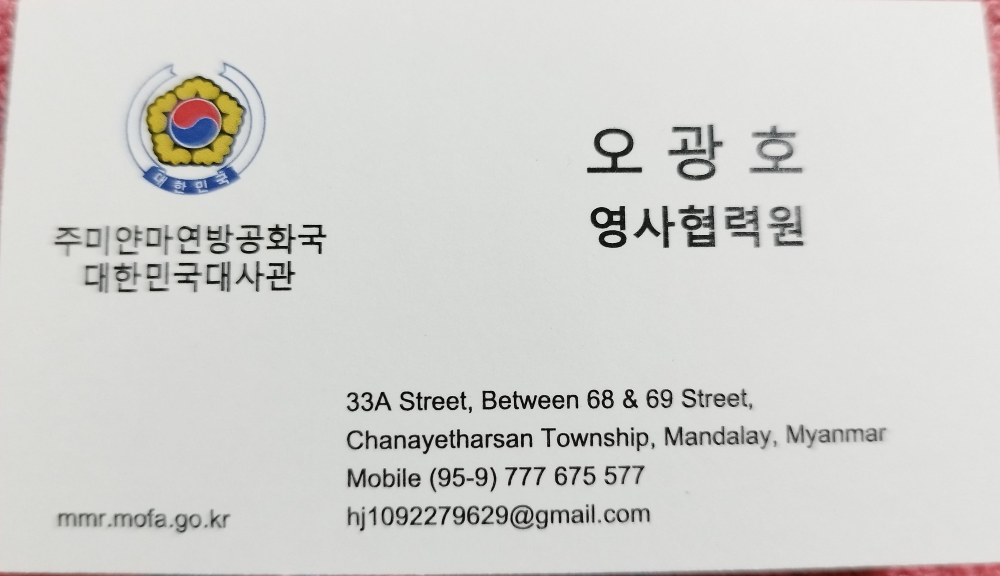
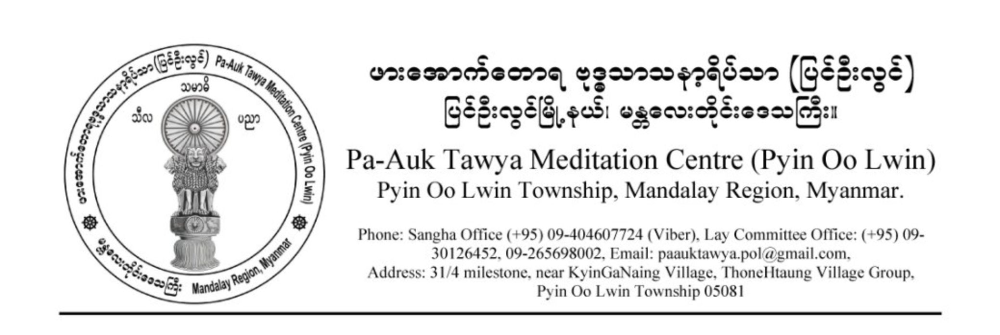

#+HTML_HEAD: 

* 목차 :TOC_2_gh:
-  [[#하루-일과][하루 일과]]
-  [[#승원-주요-일정][승원 주요 일정]]
-  [[#법문-및-수업][법문 및 수업]]
-  [[#인터뷰][인터뷰]]
-  [[#주요-시설들][주요 시설들]]
-  [[#기타][기타]]
-  [[#월간-일정들][월간 일정들]]
-  [[#관련-사이트들][관련 사이트들]]
- [[#footnotes][Footnotes]]

*  하루 일과
  - 
    | 이름           | 시작시간 | 종료시간 | 우든 공 소리 시간 |
    |----------------+----------+----------+-------------------|
    | 새벽 찬팅      | 4:00     | 4:30     | 3:30              |
    | 새벽 수행      |          |          |                   |
    | 아침 공양      |          |          | 여명 따라 다름    |
   | 아침 수행      | 8:00     | 10:00    | 7:15              |
    | 점심 공양      | 10:45    | 11:45    | 10:15             |
    | 오후 수행      | 13:00    | 16:00    | 12:45             |
    | 인터뷰 및 경행 | 16:30    | 17:30    |                   |
    | 저녁 찬팅      | 18:00    | 18:30    | 17:30             |
    | 저녁 수행      | 18:30    | 19:30    |                   |

- 
*  승원 주요 일정
    | 삥우린 일정                     | 날짜                     | 시작 시간(써머타임 적용) | 장소                                                                                      |
    |---------------------------------+--------------------------+--------------------------+-------------------------------------------------------------------------------------------|
    | - 4.1 우꾸마라 사야도 인터뷰    | 매 짝수날(남)/홀수날(여) | 16:30                    | 담마기리 2층(남)                                                                        |
    | - 4.2 파욱 사야도지 줌 인터뷰 | 자주 바뀌므로 공지 확인 | 15:35                    | 담마기리 |
    | - 3.1 오후 법문                 | 매 우포사타 날 전날      | 16:30                    | 담마기리 3층                                                                           |
    | - 3.2 오전 법문                 | 매 2,4주째 일요일        | 8:00                     | 공양간 3층                                                                               |
    | 빠띠목카 낭송                   | 빠띠목카 날              | 14:00                    | 남성 법당                                                                                 |
    | - 3.4. 위니야 수업              | 우뽀사타 날              | 16:30                    | 담마기리 3층                                                                           |

  - [[file:주의사항.md][주의사항]]
    - 주요 일정 공지는 공양간 게시판에 게시되거나 바이버 채널(FIRE
      Fighter) 을 통해 미리 공지됩니다. 바이버가 설치되어 있다면
      통역자나 종무소 빅쿠에게 해당 채널에 초대해달라고 문의하기
      바랍니다.
    - 모든 일정들은 지도 법사의 일정에 따라 변경될 수 있습니다.
    - 위 시간들은 써머타임 적용 시 시간들입니다. 빠띠목카 찬팅을 제외한
      모든 위 일정들은 써머타임 해제 시 30분 앞당겨 집니다. 예) 오후
      법문 16:30분 -> 16:00
    - 주요 일정을 제외한 일정 들은 공지를 참조 바랍니다.

*  법문 및 수업
***  오후 법문
    - 법사: 우꾸마라 사야도
    - 내용: 다양한 법문
    - 비고: 통역 필요시 다음 내용 클릭하기 바랍니다: - ### 법문 통역
      듣는 법 이하 동일,
    - 계사가 우꾸마라 사야도가 아닐 경우 이날 [[file:닛사야.md][닛사야]]
      (의지처)[fn:5]를 신청합니다. (빅쿠) , 셰얄레이들이나 재가자들은
      십계를 받습니다.
    - 법사가 다른 나라로 잠시 가신 경우 해당 법사와 관련된 모든 일정은
      취소 됩니다.

***  오전 법문
    - 법사: 우꾸마라 사야도
    - 내용: 붓다와 대제자들
***  빠띠목카 오와다
    - 법사: 주로 우꾸마라 사야도가 하지만 다른 사야도가 하시기도 합니다.
    - 내용: 다양한 법문
***  위니야 수업
    - 법사: 우꾸마라 사야도
    - 내용: 위니야에 대한 전반적인 내용
*  인터뷰
***  우꾸마라 사야도 인터뷰
    - 먼저 온 빅쿠 순서대로 인터뷰 진행
    - 통역 필요시 통역자에게 요청할 것 이하 동일.
***  파욱 사야도지 줌 인터뷰
    - 와사 순으로 진행, 보통 미얀마 빅쿠들이 먼저 함.
    - [[file:주의사항.md][주의사항]] : 자신의 수행 당면 과제 외에 교학과
      관련된 질문을 하지 말 것
***  담마팔라 반떼 인터뷰
    - 재가자들이 공양간 1층서 인터뷰 함.
*  주요 시설들
***  담마기리 위하라
    - 상가 종무소
      - 시간 : 09:30 / 16:30 휴일 : 매 빠띠목카
      - 다루는 일: - ### 비자 연장 , 각종 문의 사항 질문
*** 재가자 사무소 + 기념품 샵
      - 시간 : 08:00 / 13:00 휴일: 일요일 오후 휴무
      - 다루는 일: 통신 카드 마련, 필수품 관련 사항 , 택배
***  공양간
    - 보통 법랍 순으로 앉습니다.
    - 빅쿠 상기까 물품 테이블이 있습니다. 본인에게 남은 공양 음식을 올려
      놓거나 본인이 취할 수 있습니다.
    - 빅쿠 약품 선반이 있습니다. 간단한 약은 여기서 취할 수 있습니다.
    - 빤스꿀라(paṃsukūla) 가사들이 있습니다.
***  구 법당(Old meditation hall)
    - 보통 법랍 순으로 자기 자리가 있습니다.
    - 빅쿠 상기까 물품 테이블이 있습니다. 본인에게 남은 공양 음식을 올려
      놓거나 본인이 취할 수 있습니다.
***  😫클리닉
    - 
      | 클리닉 | 휴무                                | 시간                                   | 장소        | 담당의           | 비고       |
      |--------+-------------------------------------+----------------------------------------+-------------+------------------+------------|
      | 양의   | 우뽀사타 전날/ 당일 / 다음날은 휴무 | 아침 공양 후                           | 꾸띠        | 반떼 수라 빤디따 | 양약       |
      | 치과   |                                     | 의료 봉사하는 치과의사 일정따라 공지됨 | 덴탈 클리닉 | 랜덤             | 이빨 치료  |

***  기타
    - 빅쿠 전용 세탁 및 건조실. 세탁기 4대와 건조기 2대가 있음. 
    - 와불상 : 압바나 [fn:2] 혹은 각종 행사.
    - 스탠딩 붓다 시마 (공사중)
    - 파욱 사야도지 꾸띠
    - 빠리와사 [fn:1] 승원 : 빠리와사를 보내는 곳.
    - 우꾸마라 사야도 꾸띠
    - 우찬디마 사야도 꾸띠
    - 발우 굽는 곳/ 염색하는 곳

*  기타
  
*** 각종 특수 상황
    - 물이 안 나옵니다. 전기가 안 들어 옵니다.
      - [[file:상가%20종무소.md][상가 종무소]]에 가서 사정을 이야기
        합니다.
      - +(작성중) 꾸띠 수리 요청 사이트에 문제를 업로드 합니다.
        [[file:사이트%20이용법.md][사이트 이용법]]+
    - 아파서 공양 갈 상황이 안됩니다.
      - 다른 빅쿠에게 공양을 부탁하기 바랍니다. 빅쿠가 공양간에 이야기
        하면 공양을 차로 아픈 빅쿠 꾸띠로 가지고 옵니다. 주의사항: 미리
        이야기 해야 함.
    - 몸이 아픕니다.
      - 의료 담당 빅쿠들을 만나서 진찰을 받아 봅니다. -
	 ### 5.4 😫클리닉
    - 승원 밖으로 나갈 일이 생겼습니다.
      - 
        1. [[file:상가%20종무소.md][상가 종무소]]로 가서 외출 사유를
           이야기하고 외출증을 작성한 뒤 사인을 받습니다.
      - 
        2. [@2] 우꾸마라 사야도께 외출증 사인을 받음.
    - 심각한 질병에 걸린 듯 합니다. 혹은 여기서 해결하기 어려운
      문제입니다.
      - ##빅쿠 의료 담당 빅쿠들과 면담 하에 군 병원 방문(빅쿠들은 치료
        무료)
    - 당장 신변에 위협을 줄 상황이 도래했습니다.
      - 대사관 관련 직원에게 연락해봅니다.
	 
      - 김진철 대사관 실무관: +959421014856

    - 택배 보낼 일이 생겼습니다.
      
        1. (송신자) 한국에서 다음 주소로 보낸다.
	   
        - 삥우린 주소: 31/4 milestone, near KyinGaNaing Village,
          ThoneHtaung Village Group, Pyin Oo Lwin Township 05081

      - 
        2. [@2] (수신자) 택배 트래킹 넘버를 통해 '17
           track(안드로이드)'와 같은 앱으로 상태 확인.

      - 
        3. [@3] (무조건) 배송실패가 뜸. 양곤에 택배가 잡혀 있기 때문

      - 
        4. [@4] 그 때 재가자 종무소에 가서 자기에게 택배가 왔음을
           깝삐야에게 알림.
*** 비자 연장
**** 빅쿠
      - 최신 내용은 상가 종무소서 확인 바랍니다
      - 1년 이상 지낼 경우 무료 비자 신청을 할 수 있음. 
**** 재가자
      - 1개월 마다 연장해야 함. 
*** 담당 의무(듀티)
    - 각 빅쿠마다 담당 의무가 있습니다. 의무는 게시판에 공지되거나 책임
      빅쿠들에게서 전달됩니다.
    - 수행시트 작성 의무: 각자 수행 시트를 작성하고 우 꾸마라
      비왐사로부터 결제를 받습니다.
    - 70세 이상은 듀티 면제
*** 세나니 승원 출판물 PDF (클릭하면 구글 링크로 이동)
    - [[https://drive.google.com/file/d/1wpjVp4RtLZY1nKxoGHiZDzGjkj-jQ2cg/view?usp=drive_link][위나야
      1]]
      - The Buddhist Monastic Code, Volumes I(Ṭhānissaro Bhikkhu)을
        바탕으로 담마다야다 반떼께서 편역한 위나야 전반에 관한 문서
        - [[file:주의사항.md][주의사항]] : 수정 편집 중인 문서 이므로
          적극적 배포 하지 않길 바랍니다.
    - [[https://drive.google.com/file/d/1JxLA3koX6-xed9CivVrkhR_PdCuzM9C7/view?usp=drive_link][위나야
      2]]
      - The Buddhist Monastic Code, Volumes II(Ṭhānissaro Bhikkhu)을
        바탕으로 담마다야다 반떼께서 편역한 위나야 전반에 관한 문서
    - [[https://drive.google.com/file/d/11DpPIucuAy6lx_284oEBQc1m55eYC9_Q/view?usp=drive_link][파욱
      독송 예경문 PDF]]
      - 삥우린 아침 저녁 찬팅의 빨리어와 한글 번역을 볼 수 있는 문서
    - [[https://drive.google.com/file/d/1dEXBZu1HbCUucnKHrprDyKCqgu3-Q5w9/view?usp=drive_link][빠띠목카
      빨리어 영어 한글]]
      - 빠띠목카 227계를 빨리어, 영어, 한글로 번역한 문서

*** 상기까 아이템 [fn:3]
    - 상가 소속 빅쿠들이 쓸 수 있는 필수품입니다. 상기까 테이블에 본인이
      보시하고 싶은 필수품을 올려놓을 수도 있습니다. 공양간, 구 명상홀에
      상기까 테이블이 하나씩 있습니다.
    - 상가 종무소 주변에 상가 창고가 두 곳 있습니다. 여기 있는 상기까
      아이템을 쓰려면 다음 절차가 필요합니다.
      - 
        1. 종무소 담당 빅쿠로부터 키를 받아 (ex: I need sangha warehouse
           key)
      - 
        2. [@2] 필요한 필수품을 손에 들고 종무소 담당 빅쿠에게 가져가서
           이것이 필요하다고 합니다.
      - 
        3. [@3] 이후 종무소 담당 빅쿠로부터 받아서 사용할 수 있습니다.
      - 몇몇 가루반다(중성물) [fn:6] 들은 대여만 가능합니다.

  - 
*** 인터뷰 통역 관련
    - 현 통역자와 상담 바랍니다.

  - 
*** 법문 통역 듣는 법
    - 통역은 통역자가 송신기를 켜고 말을 하면 FM 라디오로 신호를 수신해
      듣는 시스템으로 되어 있습니다.
    - 준비물: 스마트폰 내장 FM 라디오 앱 혹은 라디오 + 유선 이어폰
    - 먼저 본인 스마트폰에 내장 FM 라디오가 있는지 확인해 보십시오 ->
      통역자에게 여분의 라디오가 있는지 물어 보십시오 -> 상가 사무소에서
      찾아 보십시오. -> 없으면 기념품샵서 마련하길 바랍니다.
    - 라디오 사용시 (기념품 샵에서 마련 가능)
      - 전원을 켠 후 FM 라디오 주파수 105.0으로 맞춥니다.
    - 스마트폰 내장 라디오 사용시
      - 내장 FM 라디오 앱을 켠 후 주파수 105.0으로 맞춥니다.
    - [[file:주의사항.md][주의사항]]
      - 모델에 따라 스마트폰들은 내장 라디오를 가지고 있지 않을 수
        있습니다.
      - 구글 플레이서 받을 수 있는 인터넷 웹 라디오 팟캐스트 앱으로 들을
        수 없습니다.
      - 안테나를 제대로 펴지 않을 시에 라디오 신호가 안 들리거나 잡음이
        심할 수 있습니다.
      - 다른 주파수들은 다른 나라 통역자들이 쓰고 있습니다.

- 
*  월간 일정들
  - 설 명절
  - 띤찬 축제: 미얀마의 설이라고 보면 됨
  - 웨삭
  - 파욱 사야도지 생신
  - [[file:와사.md][와사]] 관련
    - 와사 시작
    - 와사 끝
    - 빠와라나(자자)
    - 까티나 행사: 빠와라나 후 일주일 내에 보통 함.
  - 아리야담마 마하테라 [fn:4] (스리랑카) 입적 추모식

- 
*  관련 사이트들
  - [[https://youtube.com/@dt-ukmrbvs?si=ZLGH3wl-ksf5nVY6][우꾸마라
    사야도 법문 유튜브 채널]]
  - [[https://youtube.com/playlist?list=PLwPRVnOl9zhcCg18jahQlULDpr7cenp5S&si=5BfeV4cQ0ArQFdKg][우꾸마라
    사야도 위니야 수업 유튜브 리스트]]

* Footnotes
[fn:1] 빠리와사(Parivāsa, 別住, 보호관찰, probation): 13가지 상가디세사
  범계를 하고 난 후에 당일 동료 빅쿠에게 알리지 않고 하루를 넘기면, 숨긴
  날 수만큼 청정 상가와 떨어진 별도의 거주처에서 지내며 참회해야 하는
  벌칙
[fn:2] 압바나 : (abbhāna, 출죄, 복귀, rehabilitation)
[fn:3] 상기까 아이템: saṅghika: [adj.] . belonging to the Saṅgha(Order).
  item: 물품. 그래서 '상가에 속하는 물품'을 뜻함.
[fn:4] 아리야 담마 마하테라: 여기에서 수행하셨던 스리랑카 장로의 입적
  추모식
[fn:5]  붓다께서는 닛사야(Nissaya, 의지처, dependence)라고 하는 도제(徒弟,
    apprenticeship) 기간을 마련하셨습니다. 갓 계를 받은 모든 빅쿠는
    스스로 자신을 돌볼 만큼 능력을 갖추었다고 여겨지기 전 최소 5년간
    경험이 있는 빅쿠 아래서 공부해야 합니다. -
    [[https://drive.google.com/file/d/1wpjVp4RtLZY1nKxoGHiZDzGjkj-jQ2cg/view?usp=drive_link][위나야
    1]]
[fn:6] 가루반다(garu·bhaṇḍa): 율장에서 분류된 상가 재산 가운데
  무거운/고가 물품. 승원 부지, 건물, 가구 등이 포함됨.

